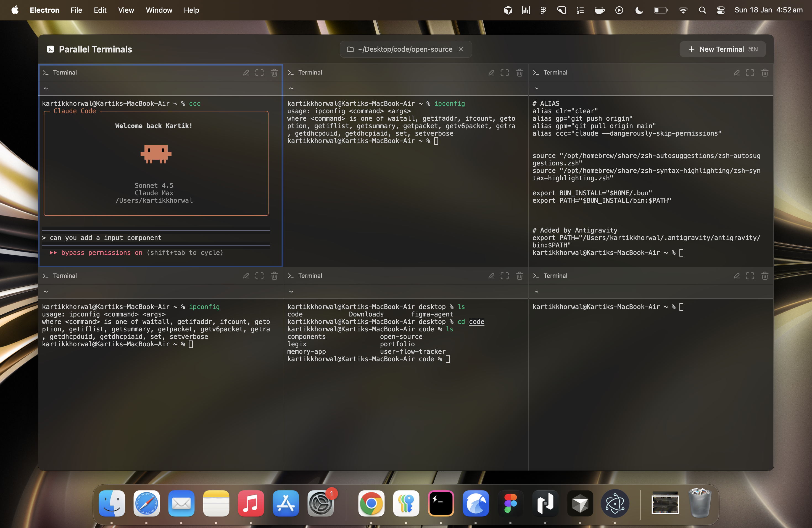

# Parallel Terminals

A modern, elegant desktop application for managing multiple terminal sessions in a beautiful grid layout. Built with Electron, React, and xterm.js.

<br>

## ✨ Features

- **Grid Layout** - View multiple terminals simultaneously in an adaptive grid
- **Keyboard Navigation** - Switch between terminals with `⌘⌥←` and `⌘⌥→`
- **Quick Terminal Creation** - Create new terminals instantly with `⌘N`
- **Focus Mode** - Fullscreen any terminal for focused work
- **Terminal Renaming** - Customize terminal names for better organization
- **Default Directory** - Set a starting directory for all new terminals
- **Smart Focus Management** - Automatic input focus when switching terminals
- **Session Persistence** - Your terminals and settings are saved across app restarts
- **Native macOS Design** - Transparent UI with backdrop blur effects

<br>

## 📸 Preview



<br>

## 🚀 Quick Start

### Prerequisites

- **Node.js** >= 14.x
- **npm** >= 7.x or **bun**
- **macOS** (currently only macOS is supported)

### Installation

Clone the repository and install dependencies:

```bash
git clone https://github.com/your-username/parallel-terminals.git
cd parallel-terminals
npm install
# or
bun install
```

### Development

Start the app in development mode with hot-reload:

```bash
npm start
```

The app will automatically:
- Start webpack dev server
- Launch Electron
- Enable React Fast Refresh
- Watch for file changes

<br>

## ⌨️ Keyboard Shortcuts

| Shortcut | Action |
|----------|--------|
| `⌘N` | Create new terminal |
| `⌘⌥←` | Navigate to previous terminal |
| `⌘⌥→` | Navigate to next terminal |
| `Esc` | Exit focus mode |

<br>

## 🎯 Usage

### Creating Terminals

- Click the **"New Terminal"** button in the top bar
- Or press `⌘N` to quickly create a new terminal
- New terminals automatically receive focus

### Navigating Terminals

- **Click** any terminal to make it active
- **Keyboard navigation**: Use `⌘⌥←` and `⌘⌥→` to switch between terminals
- Navigation doesn't loop - it stops at the first/last terminal

### Renaming Terminals

- **Double-click** the terminal name in the header
- Or click the **rename icon** (pencil)
- Press `Enter` to save or `Esc` to cancel

### Focus Mode

- Click the **focus icon** (expand) on any terminal
- The terminal expands to fullscreen with a backdrop
- Press `Esc` or click the backdrop to exit
- Or click the **collapse icon** to exit focus mode

### Setting Default Directory

- Click **"Set Starting Directory"** in the top bar
- Select a directory
- All new terminals will start in this directory
- Click the **X** to clear the default directory

### Closing Terminals

- Click the **trash icon** on any terminal
- The last terminal cannot be closed (minimum of 1 terminal)

<br>

## 📦 Building for Production

### Package for macOS

Build the app for your local platform:

```bash
npm run package
```

This creates a distributable `.app` file in `release/build/`:
- `Parallel Terminals.app` - Application bundle
- `Parallel Terminals-{version}-arm64.dmg` - DMG for Apple Silicon
- `Parallel Terminals-{version}-x64.dmg` - DMG for Intel Macs
- `Parallel Terminals-{version}-universal.dmg` - Universal DMG

### First Launch

Since the app is not notarized, macOS will show a security warning on first launch:
1. Right-click the app → "Open"
2. Or go to System Preferences → Security & Privacy → "Open Anyway"

<br>

## 🏗️ Project Structure

```
parallel-terminals/
├── src/
│   ├── main/                      # Electron main process
│   │   ├── main.ts               # Main entry point & IPC handlers
│   │   ├── preload.ts            # Preload script (context bridge)
│   │   └── util.ts               # Utility functions
│   │
│   └── renderer/                  # React app
│       ├── components/
│       │   ├── Terminal.tsx      # xterm.js wrapper component
│       │   ├── TerminalCard.tsx  # Terminal card with controls
│       │   └── Topbar.tsx        # Top bar with controls
│       │
│       ├── services/
│       │   └── TerminalManager.ts # Terminal lifecycle management
│       │
│       ├── store/
│       │   └── terminalStore.ts  # Zustand state management
│       │
│       ├── hooks/
│       │   └── useKeyboardShortcuts.ts # Keyboard shortcuts hook
│       │
│       ├── constants/
│       │   └── index.ts          # App-wide constants
│       │
│       ├── App.tsx               # Main app component
│       └── index.tsx             # React entry point
│
├── assets/                        # Icons and resources
└── release/                       # Build output
```

<br>

## 🛠️ Key Technologies

- **[Electron](https://www.electronjs.org/)** - Cross-platform desktop app framework
- **[React 19](https://react.dev/)** - UI framework
- **[TypeScript](https://www.typescriptlang.org/)** - Type safety
- **[xterm.js](https://xtermjs.org/)** - Terminal emulator
- **[node-pty](https://github.com/microsoft/node-pty)** - Pseudo-terminal for shells
- **[Zustand](https://zustand-demo.pmnd.rs/)** - State management
- **[Tailwind CSS](https://tailwindcss.com/)** - Styling
- **[Webpack](https://webpack.js.org/)** - Module bundler

<br>

## 📁 Configuration

### Session Data Location

Terminal sessions and settings are persisted to localStorage in the browser context.

### Application Data

Application data is stored in:
```
~/Library/Application Support/parallel-terminals/
```

<br>

## 🐛 Troubleshooting

### Terminal Not Working

If terminals don't work properly:
1. Check that node-pty is properly rebuilt:
   ```bash
   npm run rebuild
   ```
2. Verify your shell exists: `echo $SHELL`
3. Try restarting the app

### Build Issues

If you encounter build errors:
1. Clear cache and rebuild:
   ```bash
   rm -rf node_modules release
   npm install
   npm run build
   ```

### Focus Issues

If terminal input focus isn't working:
- Try clicking directly on the terminal area
- Use keyboard shortcuts (`⌘⌥←` / `⌘⌥→`) to switch terminals
- Ensure you're not in rename mode (press `Esc` to exit)

<br>

## 🔧 Development Commands

```bash
# Start development with hot-reload
npm start

# Build for production
npm run build

# Package the app
npm run package

# Run linter
npm run lint

# Fix linting issues
npm run lint:fix

# Rebuild native modules
npm run rebuild
```

<br>

## 🤝 Contributing

Contributions are welcome! Here's how you can help:

1. Fork the repository
2. Create a feature branch (`git checkout -b feature/amazing-feature`)
3. Commit your changes (`git commit -m 'Add amazing feature'`)
4. Push to the branch (`git push origin feature/amazing-feature`)
5. Open a Pull Request

Please ensure your code:
- Follows the existing code style
- Includes appropriate comments
- Works on macOS (primary platform)

<br>

## 🗺️ Roadmap

- [ ] Windows & Linux support
- [ ] Custom themes
- [ ] Terminal splitting (horizontal/vertical)
- [ ] Terminal search
- [ ] Export terminal logs
- [ ] Custom keyboard shortcuts
- [ ] Terminal groups/workspaces
- [ ] Session import/export

<br>


## 🙏 Acknowledgments

- Built with [Electron React Boilerplate](https://github.com/electron-react-boilerplate/electron-react-boilerplate)
- Terminal powered by [xterm.js](https://xtermjs.org/)

<br>

